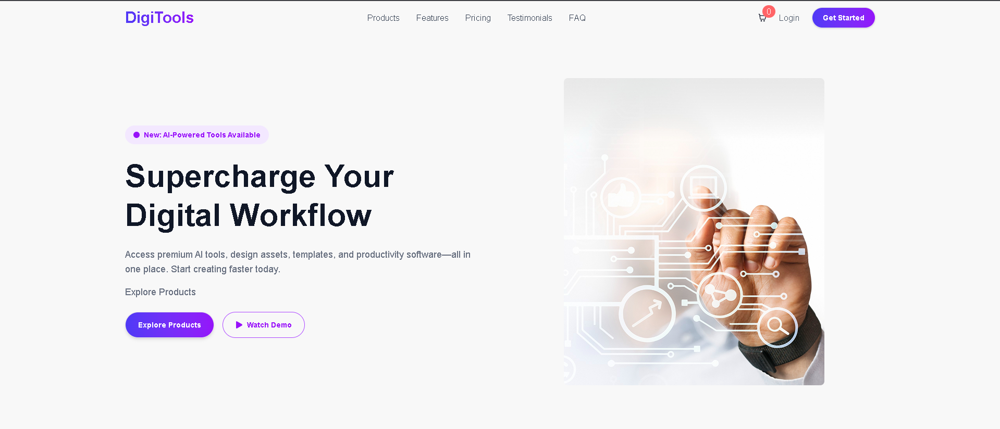

# 🚀 DigiTools Platform

## 📖 Description
This project is a modern, fully responsive e-commerce-style web application built using React.js and Tailwind CSS. It allows users to browse a collection of digital products, view detailed features, and add items to a dynamic cart system. The application includes interactive UI sections such as a toggleable product/cart view, real-time cart updates, and toast notifications for user actions like adding or removing items. Designed based on Figma, it ensures a clean and user-friendly interface across all devices while demonstrating efficient state management and component-based architecture.

---

## 🛠️ Technologies Used
- HTML5
- CSS3 / Tailwind CSS
- JavaScript (ES6+) / React.js
- React-Toastify (NPM Package)
- JSON (for product data)

---

## ✨ Features
- ✔️ Dynamic Cart System with Real-Time Updates
Users can add or remove products from the cart, instantly see the updated item count in the navbar, and view the total pricing. The cart can also be fully cleared using the “Proceed to Checkout” button.
- ✔️ Interactive UI with Section Toggling
The application allows users to switch seamlessly between the Product list and Cart view using toggle buttons, improving usability and keeping the interface clean and organized.
- ✔️ Toast Notifications for User Actions
Integrated React-Toastify provides instant feedback for actions like adding items to the cart, removing them, or completing checkout, enhancing user experience and interaction clarity.
- ✔️ Responsive design
- ✔️ User-friendly interface

---

## 📂 Project Structure
The project follows a clean and modular structure based on React’s component-driven architecture. The application is divided into reusable components such as Navbar, Banner, Product Cards, Cart, Stats, and Footer, each responsible for a specific part of the UI. Product data is managed through a separate JSON file, keeping the data layer organized and easy to maintain.

State management is handled at a higher level (such as the main App component) to control features like cart operations and section toggling. The UI styling is implemented using Tailwind CSS and DaisyUI, ensuring consistency and responsiveness across devices. Additionally, utility functions and third-party integrations like React-Toastify are structured separately to keep the codebase scalable, readable, and easy to extend.
